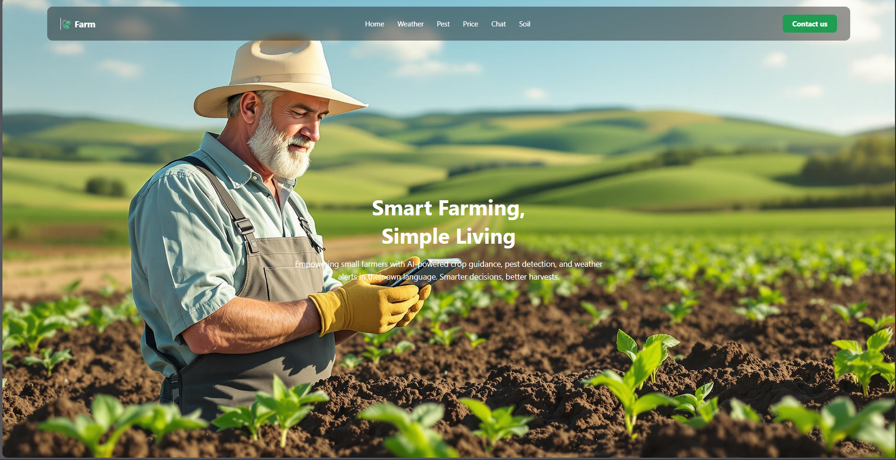
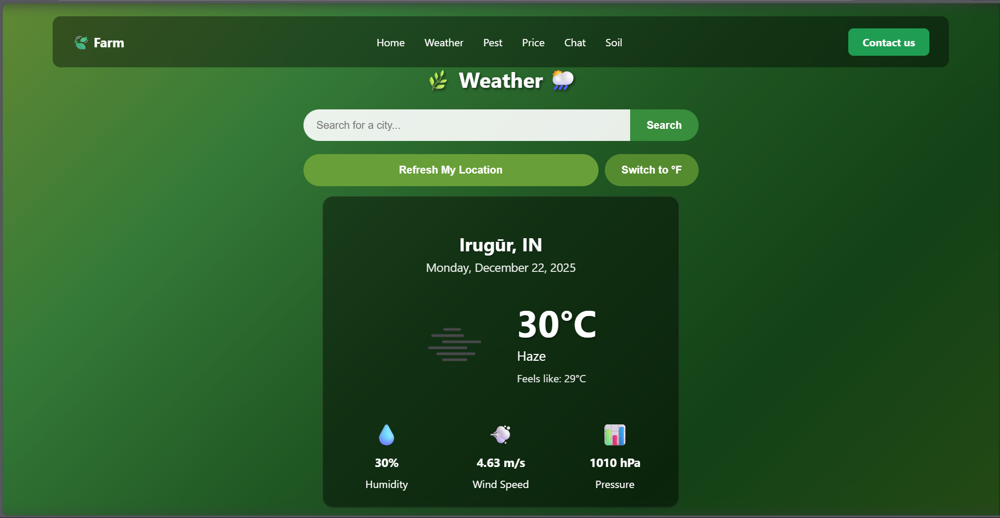

# 🌱 Farming Advisory – AI-Based Smart Agriculture Assistant

🚜 **Farming Advisory** is a multilingual, AI-powered web/mobile application designed to help **small and marginal farmers** make informed decisions using **real-time weather, pest detection, AI chatbot, and market price insights**.

---

## 📌 Table of Contents
- [Features](#-features)
- [Technology Stack](#-technology-stack)
- [System Architecture](#-system-architecture)
- [Modules Explanation](#-modules-explanation)
- [Screenshots](#-screenshots)
- [Installation & Setup](#-installation--setup)
- [Contributors](#-contributors)
- [License](#-license)

---

## ✨ Features

✅ Real-time weather alerts  
✅ Image-based pest/disease detection  
✅ AI chatbot (text + voice)  
✅ Market price comparison  
✅ Low-literacy friendly UI  
✅ Secure user profiles  
✅ Feedback collection  

---

## 🧰 Technology Stack

| Layer | Technology |
|-----|-----------|
| Frontend | React.js, JavaScript, CSS |
| Backend | Node.js, Express |
| Database | MongoDB |
| APIs | Weather API, Market API |
| AI | Image recognition + NLP |
| Tools | Git, GitHub, Postman |

---

## 📁 Project Structure
<pre>
├── frontend/
│ └── src/
│ ├── components/
│ ├── pages/
│ └── App.js
│
├── backend/
│ ├── server.js
│ └── app.py
│
└── README.md
</pre>

---

## 🧩 Modules Explanation

### 🌦️ Weather Module
- Fetches real-time & forecast weather
- Sends alerts for rain, heatwaves, frost
- Advises irrigation & crop safety

---

### 🐛 Pest & Disease Detection
- Farmer uploads crop image
- AI model identifies disease
- Returns treatment & prevention steps

---

### 💬 AI Chatbot
- Multilingual support
- Voice-enabled 
- Personalized answers using farm data

---

### 💹 Market Price Module
- Shows real-time crop prices
- Nearby market comparison
- Helps farmers sell at the right time

---

## 🖼️ Screenshots

<details>
<summary>Click to view</summary>

### 🔐 Signup Page


### 🏠 Home


### 🌦️ Weather


### 🐛 Pest Detection


### 💹 Market Price


</details>

---

## ⚙️ Installation & Setup

### 🔹 Prerequisites
- Node.js
- MongoDB
- React

---

### 🔹 Clone Repository
```bash
git clone https://github.com/your-username/farming-advisory.git
cd farming-advisory
🔹 Backend Setup
cd backend

python -m venv .venv
.\.venv\Scripts\Activate.ps1
uvicorn app:app --reload --port 8000

node server.js

Create .env

WEATHER_API_KEY=111111111111111111111111111111111111
GEMINI_API_KEY=111111111111111111111111111111111111
GEMINI_MODEL=gemini-1.5-flash
ALLOWED_ORIGINS=*
MAX_IMAGE_MB=8

🔹 Frontend 
npm start
```

👨‍💻 Contributor

Kirubakaran – Full Stack Developer
Open for contributions ❤️

📄 License

This project is licensed under the MIT License.

<p align="center">⭐ Support</p>
<p align="center">If you like this project, give it a ⭐ on GitHub!</p>
<p align="center"> Built with ❤️ by <b>Kirubakaran</b> </p> 

